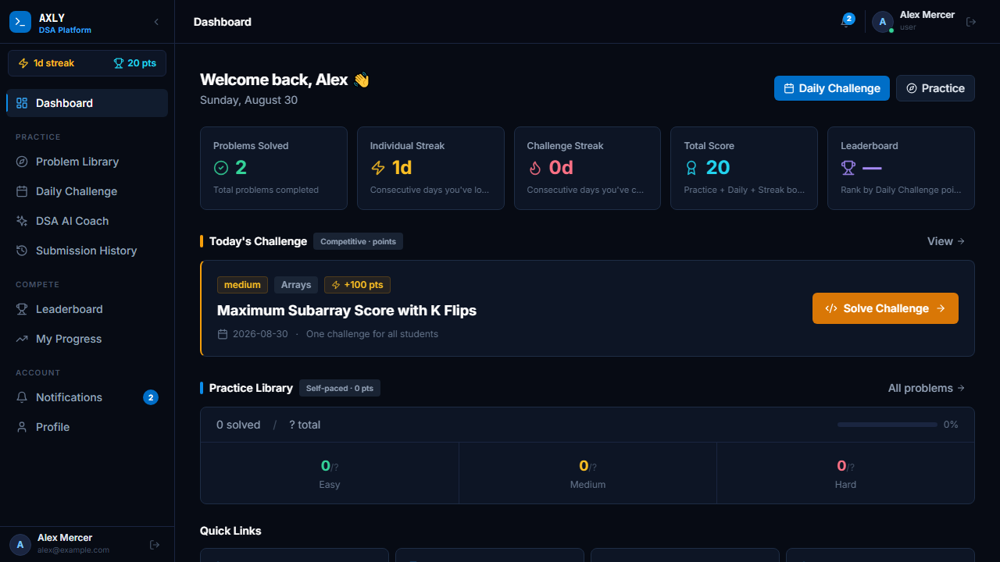
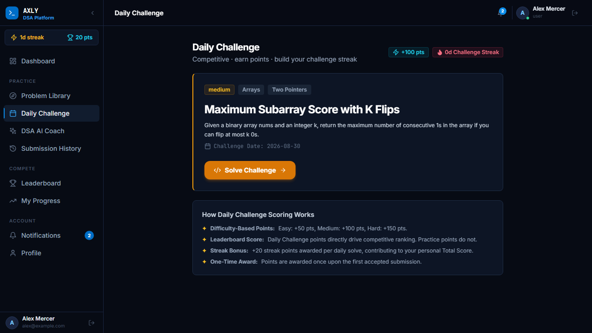
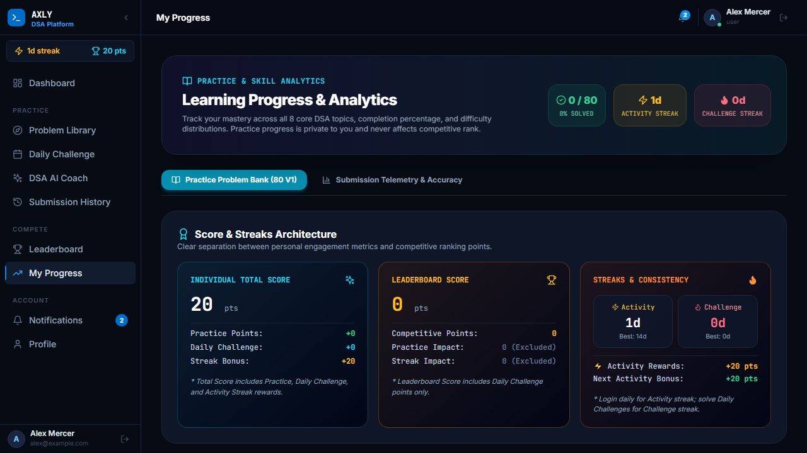
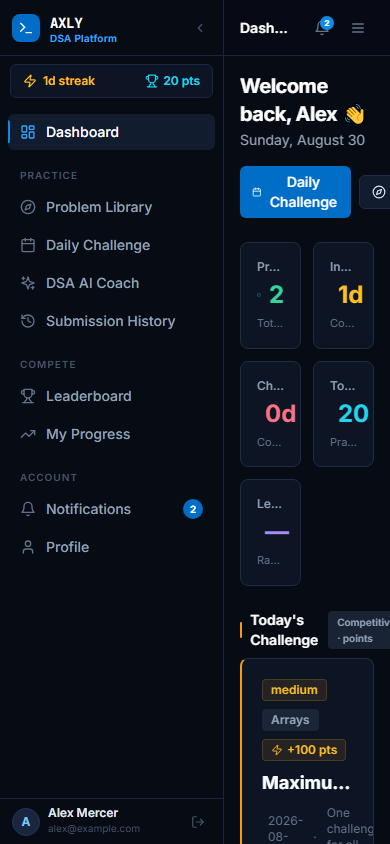

<div align="center">

# Axly DSA Tracker

**Production-oriented DSA learning platform combining structured practice, competitive Daily Challenges, and deterministic-first AI coaching.**

[](#-testing)
[](#-code-execution)
[](#-technology-stack)

**Production:** `https://dsatracker.axly.in`  
**Repository:** `https://github.com/Ravikiran9988/axly-dsa-tracker`

</div>

---

## 📸 Product Preview

### Dashboard & Daily Challenge Widget


### 80-Problem Practice Library


### Problem Workspace + AI Coach


### Competitive Daily Challenge


### Progress Analytics


### Mobile Responsive Design


---

## 🧭 What is Axly?

Axly is a specialized platform designed for serious Data Structures & Algorithms learning. It moves beyond generic CRUD systems by enforcing a strict separation between **learning (Practice)** and **competition (Daily Challenges)**, all guided by a context-aware **AI Coach**.

- **For learners:** A curated 80-problem curriculum with structured topics and patterns.
- **For competitors:** A single, UTC-synchronized daily problem that tests problem-solving under constraints.
- **For both:** The DSA AI Coach, which prefers deterministic, verified explanations over raw LLM hallucinations.

## ⚡ Why Axly?

- **Strict Separation of Concerns:** Practice problems build knowledge without the pressure of points. Daily Challenges provide competitive leaderboards.
- **Deterministic-First AI Coaching:** Before hitting an LLM, the AI checks a rigorous Knowledge Graph. It provides progressive hints instead of instantly revealing solutions.
- **Verified Code Execution:** 100% of submitted code runs securely in a sandboxed subprocess against hidden test cases.
- **Production-Grade Reliability:** Robust multi-key fallback for LLMs (Groq), automated background cron jobs, and 306 passing backend tests.

---

## 🛠️ Core Features

### 📚 Practice Library
- 80 hand-curated DSA problems across 8 topics (Arrays, Strings, Hashing, Two Pointers/Sliding Window, Stack, Binary Search, Trees, DP).
- Granular filtering by difficulty, topic, pattern, and completion status.
- Zero competitive points awarded—purely for mastery.

### 🏆 Daily Challenge
- One synchronized challenge active for a strict 24-hour UTC window.
- Leaderboard driven purely by Daily Challenge completions.
- Distinct dataset separate from the Practice Library to prevent spoiler advantages.

### 🤖 DSA AI Coach (4-Phase Architecture)
- **Phase 1 (Deterministic):** Maps queries to the problem's Knowledge Graph (Topic, Pattern, Complexity).
- **Phase 2 (LLM Router):** Fails over intelligently across multiple Groq API keys (`GROQ_API_KEY_1`, `2`, `3`) to handle rate limits gracefully.
- **Phase 3 (Contextual Actions):** Progressive actions (`Next Hint`, `Approach`, `Review Code`) generate dynamic follow-up UI without losing conversation history.
- **Phase 4 (Sandboxing):** The AI verifies its own generated solutions against the sandbox before showing them to the user.

### 💻 Code Execution
- Supported languages: **JavaScript, Python, TypeScript, Java, C, C++**.
- Sandboxed environment with strict CPU timeouts (e.g., 2000ms) and memory limits.
- Separate public test cases (visible) vs. hidden test cases (authoritative grading).

---

## 🆚 Practice vs Daily Challenge vs AI

|                | Practice Library | Daily Challenge | DSA AI Coach |
| -------------- | ---------------- | --------------- | ------------ |
| **Purpose**    | Learning         | Competition     | Guidance     |
| **Pace**       | Self-paced       | 24-Hour UTC     | On-demand    |
| **Points**     | 0                | Backend-defined | 0            |
| **Leaderboard**| No               | Yes             | No           |
| **Visibility** | Always available | Strict window   | Always       |

---

## 🏗️ Technology Stack

| Layer      | Technology                               |
| ---------- | ---------------------------------------- |
| **Frontend**   | React 18 + Vite + TailwindCSS            |
| **Backend**    | Node.js + Express                        |
| **Database**   | SQLite (Dev) / PostgreSQL (Prod)         |
| **Auth**       | Custom JWT implementation                |
| **AI**         | Groq (LLaMA/Mistral) + Custom Router     |
| **Execution**  | Node `child_process` Sandbox             |
| **Testing**    | Jest + Supertest (Backend), Playwright (E2E) |

---

## 🔒 Security & Reliability

- **Authoritative Backend:** The frontend never decides scoring, streaks, or test passes. All verifications are executed securely on the backend.
- **LLM Rate-Limit Protection:** If one Groq key hits a 429 Too Many Requests, the router silently falls back to the next key. If all fail, the UI degrades gracefully.
- **Isolated Executions:** Code submissions are executed in isolated processes to prevent infinite loop server crashes.
- **Environment Safety:** API keys are never leaked to the client.

---

## 🚀 Quick Start

### Prerequisites
- Node.js v18+
- npm or yarn

### 1. Clone & Install
```bash
git clone https://github.com/Ravikiran9988/axly-dsa-tracker.git
cd axly-dsa-tracker

# Install backend dependencies
cd backend && npm install

# Install frontend dependencies
cd ../frontend && npm install
```

### 2. Environment Variables
Create a `.env` file in the `backend/` directory:
```env
PORT=5000
JWT_SECRET=your_super_secret_jwt_key
FRONTEND_URL=http://localhost:5173

# Groq Multi-Key Setup (Required for AI Coach)
GROQ_API_KEY_1=your_first_groq_key
GROQ_API_KEY_2=your_second_groq_key
GROQ_API_KEY_3=your_third_groq_key
```

### 3. Database Setup & Seed
```bash
cd backend
npm run db:setup
```
*(This creates the SQLite database and seeds the 80 problems, patterns, and mock users.)*

### 4. Run the Application
Start the backend (Terminal 1):
```bash
cd backend
npm run dev
```

Start the frontend (Terminal 2):
```bash
cd frontend
npm run dev
```
Navigate to `http://localhost:5173` and use the **Dev Login** to explore.

---

## 🧪 Testing

The platform enforces strict reliability with comprehensive test suites.

| Area            | Status  | Details |
| --------------- | ------- | ------- |
| **Backend**     | Passing | 306/306 Unit & Integration Tests (Jest) |
| **DSA AI**      | Passing | Prompt injection, failover, logic routing |
| **Code Exec**   | Passing | Sandbox limits, hidden tests, timeouts |
| **E2E UI**      | Passing | Playwright flow verification |
| **Frontend**    | Passing | Production build verification |

Run tests:
```bash
# Backend suite
cd backend && npm test

# Playwright E2E UI suite
npx playwright test tests/e2e/dsa_ai_coach.spec.js
```

---

## 📂 Key Project Structure

```
axly-dsa-tracker/
├── backend/
│   ├── src/
│   │   ├── controllers/      # Route logic
│   │   ├── db/               # SQLite setup & seeders
│   │   ├── middleware/       # JWT Auth, error handling
│   │   ├── routes/           # Express API endpoints
│   │   └── services/         # Core business logic
│   │       ├── dsaAiCoachService.js
│   │       ├── executionService.js
│   │       └── dailyChallengeService.js
├── frontend/
│   ├── src/
│   │   ├── components/       # Reusable UI (DsaAiCoachPanel)
│   │   ├── pages/            # Dashboard, Practice, Workspace
│   │   └── services/         # API client
├── docs/screenshots/         # Playwright generated previews
└── tests/e2e/                # Playwright End-to-End tests
```

---

## 🧠 Key Engineering Decisions

1. **Deterministic-First AI:** We avoid passing every query directly to an LLM. Common queries (e.g., "What is the time complexity?") hit the local Knowledge Graph first, returning instantly with zero token cost.
2. **Context-Aware Action Chaining:** The AI coach provides contextual `[What Next?]` actions (e.g., `Review Code` -> `Debug`). These actions retain full conversation history to create a seamless tutoring loop.
3. **Practice & Daily Challenge Isolation:** The two systems use completely separate tables and scoring logic to prevent players from exploiting practice problems to gain competitive leaderboard ranks.

---

## 🗺️ Roadmap

### Current (V1)
- [x] 80-problem Practice curriculum
- [x] UTC-synchronized Daily Challenge
- [x] Contextual DSA AI Coach with Multi-key Failover
- [x] Sandboxed Code Execution

### Next
- [ ] Expanded DSA taxonomy and curriculum
- [ ] Advanced User Analytics (Heatmaps & Time-to-solve)
- [ ] Mentor / Peer code review mode

---

## 🤝 Contributing

1. Fork the Project
2. Create your Feature Branch (`git checkout -b feature/AmazingFeature`)
3. Commit your Changes (`git commit -m 'Add some AmazingFeature'`)
4. Push to the Branch (`git push origin feature/AmazingFeature`)
5. Open a Pull Request

---

## 📄 License

This project is not currently licensed for public use or redistribution.
