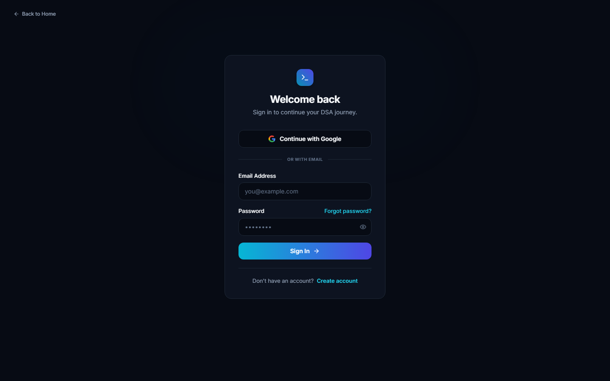
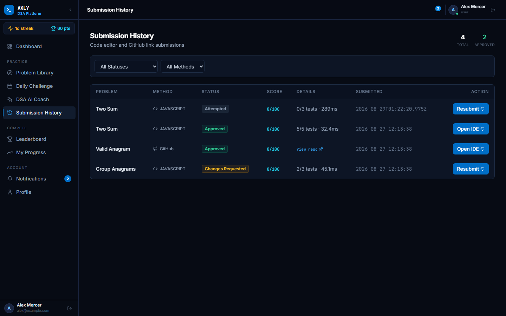

<div align="center">

# Axly DSA Tracker

**Production-oriented full-stack DSA learning platform with structured practice, competitive Daily Challenges, personal progress scoring, AI-assisted coaching, and isolated code execution.**

[](https://github.com/Ravikiran9988/axly-dsa-tracker/actions/workflows/ci.yml)
[](LICENSE)
[](#-technology-stack)

**Live App:** `https://dsatracker.axly.in`  
**Repository:** `https://github.com/Ravikiran9988/axly-dsa-tracker`

</div>

---

## 📚 Overview

Axly DSA Tracker is a full-stack platform for learning and practicing Data Structures and Algorithms through a combination of:

- **Practice Mode** for structured, self-paced problem solving.
- **Daily Challenges** for competitive daily problem solving, streaks, and the global leaderboard.
- **Personal scoring and progress** for tracking practice performance without mixing practice points into the competitive leaderboard.
- **AI DSA Coach** for hints, guidance, recommendations, and AI-assisted challenge generation.
- **Online code execution** with an isolated Docker-based runner.
- **Admin and mentor workflows** for question curation, assignments, cohorts, moderation, audit logs, and review.

The application is split into a React frontend, Express API, repository/data layer, PostgreSQL production database, and a separate execution service.

---

## ✨ Key Features

### 🧑‍💻 Practice Mode

- Curated DSA question library.
- Difficulty, topic, pattern, search, and status filters.
- Per-user progress tracking.
- Multiple attempts and solve timestamps.
- Starter code for supported programming languages.
- Topic and difficulty progress analytics.
- Practice points are stored as **personal progress/gamification points**.
- Practice points **do not increase the global competitive leaderboard score**.

### 🏆 Daily Challenge

- Dedicated daily challenge workflow.
- Admin/manual publishing support.
- Scheduled/automated challenge generation.
- Test cases and reference-solution validation.
- Daily streak tracking.
- Competitive scoring and global leaderboard.
- Duplicate/similarity safeguards for generated questions.
- A stable system identity is used for scheduled automation so generated challenges satisfy database audit foreign keys.

### 📊 Scoring & Gamification

Axly keeps two scoring concepts separate:

| Score | Purpose |
|---|---|
| **Practice points** | Personal learning/progress gamification from Practice Mode. |
| **Daily Challenge points** | Competitive points used by the global leaderboard. |

A user's overall total can include practice, daily challenge, and streak components, while **`leaderboard_score` is based on Daily Challenge points only**.

Competitive Daily Challenge submissions use a deterministic breakdown:

| Component | Maximum |
|---|---:|
| Test performance | 60 |
| Time performance | 20 |
| Attempt efficiency | 20 |
| **Final score** | **100** |

The scoring service persists values such as `test_score`, `time_score`, `attempt_score`, `final_score`, `solve_duration_seconds`, and `attempt_count` where applicable.

### 🤖 AI DSA Coach

- AI-assisted DSA guidance.
- Hints and explanations.
- Recommendation workflows.
- AI-assisted Daily Challenge generation.
- Structured question generation.
- Deterministic validation and similarity checks before generated content is accepted into platform workflows.
- Multi-key Groq configuration for API-key failover.

### 🔐 Authentication & RBAC

Supported roles:

- `user`
- `mentor`
- `admin`

Authentication uses JWT-based sessions with email verification/OTP flows. Administrative operations are protected by role-based authorization and audit logging.

### ⚙️ Online Code Execution

The coding workspace supports:

- JavaScript / Node.js
- Python
- TypeScript
- Java
- C
- C++

Supported submission outcomes include:

```text
Accepted
Wrong Answer
Time Limit Exceeded
Runtime Error
Compilation Error
```

Execution is designed around a separate Docker-based runner with resource limits and token-protected service communication.

---

## 🏗️ Architecture

```text
                           ┌────────────────────────┐
                           │      React + Vite       │
                           │       Frontend         │
                           └────────────┬───────────┘
                                        │ HTTPS / REST
                                        ▼
                           ┌────────────────────────┐
                           │    Node.js + Express   │
                           │      REST API          │
                           └────────────┬───────────┘
                                        │
                           ┌────────────▼───────────┐
                           │   Repository / Service │
                           │        Layers          │
                           └────────────┬───────────┘
                                        │
                         ┌──────────────┴──────────────┐
                         │                             │
                         ▼                             ▼
               ┌─────────────────┐          ┌─────────────────────┐
               │ PostgreSQL /    │          │ Code Execution      │
               │ Supabase        │          │ Runner (Docker)     │
               └─────────────────┘          └─────────────────────┘
                                                       │
                                                       ▼
                                              Isolated subprocesses

             ┌─────────────────────────────────────────────────────┐
             │ Practice │ Daily Challenge │ Scoring │ AI │ Admin   │
             └─────────────────────────────────────────────────────┘
```

### Production topology

```text
Vercel / Static Hosting
        │
        ▼
 React Frontend
        │
        │ HTTPS
        ▼
Heroku / Node API
        │
        ├──────────────► Supabase PostgreSQL
        │
        ├──────────────► Groq / AI Provider
        │
        └──────────────► Dedicated Docker Code Runner
                              │
                              └── Oracle Cloud / other isolated host
```

The code runner should be deployed separately from the public API so untrusted source code is not executed inside the web dyno/process.

---

## 🧰 Technology Stack

### Frontend

- React 18
- Vite
- Tailwind CSS
- React Router DOM
- Lucide React
- Framer Motion
- Monaco Editor

### Backend

- Node.js 22-compatible runtime
- Express
- JWT / JSON Web Tokens
- bcryptjs
- Zod validation
- Helmet
- CORS
- Express Rate Limit
- PostgreSQL via `pg`
- Supabase integration
- Repository/service/controller architecture

### Database

- **Production:** PostgreSQL / Supabase
- **Local development/testing:** SQLite through `better-sqlite3`
- **Migrations:** `backend/src/db/migrations/*.sql`

### AI

- Groq API
- OpenAI-compatible LLM endpoint configuration
- Similarity/deduplication validation

### Email

- Resend support
- Nodemailer / SMTP support

### Testing & CI

- Jest
- Supertest
- Playwright
- GitHub Actions
- Node.js 22 in CI

### Infrastructure

- Vercel-compatible frontend deployment
- Heroku-compatible Node API deployment with release migrations
- Docker-based code runner
- Oracle Cloud or another dedicated host for runner workloads

---

## 🖥️ UI Preview

> Screenshots are stored under `docs/screenshots/` when available.

<div align="center">

### Landing Page


### Learner Dashboard


### Problem Workspace & Code Editor


### Question Bank


### Submission History


### Admin Dashboard


### Admin Questions


</div>

---

## 🔌 API Surface

The API is organized under the `/api/v1` namespace.

| Area | Typical route group |
|---|---|
| Authentication | `/api/v1/auth` |
| Users & profiles | `/api/v1/users` |
| Questions | `/api/v1/questions` |
| Practice | `/api/v1/practice` |
| Daily Challenges | `/api/v1/daily-challenges` |
| Leaderboard | `/api/v1/leaderboard` |
| Submissions / execution | `/api/v1/submissions`, `/api/v1/code` |
| Progress / analytics | `/api/v1/progress`, `/api/v1/analytics` |
| AI | `/api/v1/dsa-ai`, `/api/v1/recommendations`, `/api/v1/ai-questions` |
| Assignments | `/api/v1/assignments` |
| Cohorts | `/api/v1/cohorts` |
| Notifications | `/api/v1/notifications` |
| Audit logs | `/api/v1/admin/audit-logs` |

The exact controller/service implementation is the source of truth for available methods and request/response payloads.

---

## 🛡️ Security Model

Axly applies multiple layers of protection around authentication, API access, and code execution.

### API

- JWT authentication.
- Role-based authorization for protected administrative/mentor operations.
- Password hashing with bcryptjs where password-based login is enabled.
- Request validation with Zod where applicable.
- Helmet security headers.
- CORS configuration.
- Rate limiting for sensitive endpoints.
- Environment-based secrets rather than committing credentials.

### Code Runner

- User source code runs in an isolated Docker environment.
- CPU/time/process limits are applied by the runner configuration.
- Runner communication can be protected with `CODE_RUNNER_TOKEN`.
- The runner should not be exposed directly to browsers or untrusted clients.
- Production API and runner should remain separately deployable.

---

## 🗄️ Database & Migrations

PostgreSQL production schema changes are maintained as ordered SQL migrations in:

```text
backend/src/db/migrations/
```

The backend migration runner applies migration files in sorted order. The repository includes reconciliation and compatibility migrations for areas such as:

- Daily Challenge data.
- Practice progress state.
- Assignments and related relationships.
- Submission and scoring metadata.
- Audit information.
- Question/version data.
- Code execution metadata.
- Fractional execution-duration compatibility.
- Scheduled Daily Challenge automation identity.

### Important production migrations

`016_duration_numeric_compatibility.sql` updates execution-duration columns to floating-point compatible PostgreSQL types so fractional values such as:

```text
1896.153
```

can be stored without integer-cast failures.

`017_daily_challenge_system_user.sql` creates the inactive database identity used by scheduled Daily Challenge automation:

```text
usr-system-cron
```

This satisfies the `created_by` foreign-key relationship without creating a normal interactive student account.

### Run PostgreSQL migrations

From the repository root:

```bash
cd backend
npm run migrate:postgres
```

Or using the root package scripts/environment appropriate to your deployment process.

### Heroku release migration

The repository `Procfile` runs the PostgreSQL migration as a release step before the web process starts:

```text
web: cd backend && node src/server.js
release: cd backend && npm run migrate:postgres
```

This keeps schema migration separate from the web dyno boot process.

---

## 🚀 Local Development

### Prerequisites

Install:

- Node.js 22 recommended (and used by CI).
- npm.
- Git.
- Docker Desktop for local code-runner development.

### Clone

```bash
git clone https://github.com/Ravikiran9988/axly-dsa-tracker.git
cd axly-dsa-tracker
```

### Install dependencies

```bash
npm install
cd backend && npm install
cd ../frontend && npm install
cd ..
```

### Configure backend environment

Copy the example file:

```bash
cp backend/.env.example backend/.env
```

Important environment variables include:

```env
PORT=5000
NODE_ENV=development

SUPABASE_URL=https://your-project.supabase.co
SUPABASE_ANON_KEY=your-anon-key
SUPABASE_SERVICE_ROLE_KEY=your-service-role-key
DATABASE_URL=your-database-url

CLIENT_ORIGIN=http://localhost:5173
APP_URL=http://localhost:5173

JWT_SECRET=your-random-secret-at-least-32-characters
JWT_EXPIRES_IN=30d

LLM_BASE_URL=https://api.groq.com/openai/v1
LLM_MODEL=openai/gpt-oss-120b
GROQ_API_KEY_1=your-first-groq-api-key
GROQ_API_KEY_2=your-second-groq-api-key
GROQ_API_KEY_3=your-third-groq-api-key

RESEND_API_KEY=your-resend-api-key
SMTP_FROM=Axly <noreply@axly.in>

CODE_RUNNER_TOKEN=your-runner-shared-token
CODE_EXECUTION_SERVICE_URL=http://localhost:<runner-port>
```

For SMTP-based email instead of Resend, configure the SMTP variables shown in `backend/.env.example`.

**Never commit real API keys, database passwords, service-role keys, JWT secrets, or runner tokens.**

### Start the backend

```bash
npm run dev:backend
```

or:

```bash
cd backend
npm run dev
```

### Start the frontend

```bash
npm run dev:frontend
```

or:

```bash
cd frontend
npm run dev
```

### Run both

```bash
npm run dev
```

Frontend default:

```text
http://localhost:5173
```

Backend default:

```text
http://localhost:5000
```

---

## 🧪 Testing

### Backend Jest suite

```bash
npm run test:backend
```

or:

```bash
cd backend
npm test
```

The backend suite covers areas including authentication, Daily Challenge workflows, practice progress/scoring, submissions, gamification, AI behavior, repositories, schema compatibility, and API-level behavior.

### Frontend build validation

```bash
npm run test:frontend
```

### Playwright E2E

From the repository root:

```bash
npm run test:e2e
```

A focused Axly E2E suite can also be run with:

```bash
npx playwright test tests/e2e/axly_v1_complete.spec.js
```

For a failed Playwright trace:

```bash
npx playwright show-trace test-results/<failed-test-dir>/trace.zip
```

---

## 🔄 GitHub Actions CI

CI is defined in:

```text
.github/workflows/ci.yml
```

The workflow currently runs on pushes and pull requests targeting `main` or `master`.

### Backend job

- Ubuntu runner.
- Node.js 22.
- `npm ci`.
- Full backend Jest suite.

### Frontend job

- Ubuntu runner.
- Node.js 22.
- `npm ci`.
- Production frontend build.

A change pushed to `main` automatically creates a new workflow run when the workflow is active.

---

## 👨‍💼 Admin & Mentor Workflows

Role-protected administration supports areas such as:

- User and role management.
- Question curation and publishing.
- Daily Challenge management.
- Assignments.
- Cohorts.
- Submission review.
- Audit logs.
- Notifications.
- Challenge generation and validation.

The platform keeps learner, mentor, and administrator responsibilities separate through RBAC middleware and controller/service authorization checks.

---

## 🧠 Daily Challenge Lifecycle

A typical Daily Challenge flow is:

```text
Create / Generate Question
          │
          ▼
Validate structure + metadata
          │
          ▼
Validate test cases / reference solution
          │
          ▼
Similarity / duplicate checks
          │
          ▼
Schedule or publish
          │
          ▼
Student submission
          │
          ▼
Deterministic scoring
          │
          ▼
Daily points + streak
          │
          ▼
Competitive leaderboard
```

Scheduled AI generation uses a dedicated inactive system user identity for database attribution rather than a real learner account.

---

## 🏅 Leaderboard Isolation

This distinction is intentional and important:

```text
Practice submission
      │
      ├── Practice progress ✅
      ├── Personal practice points ✅
      ├── Personal total score ✅
      └── Global competitive leaderboard ❌

Daily Challenge submission
      │
      ├── Daily Challenge score ✅
      ├── Streak / competitive points ✅
      ├── Personal total score ✅
      └── Global competitive leaderboard ✅
```

The gamification layer keeps `leaderboard_score` tied to Daily Challenge points rather than Practice points. Regression tests cover this isolation so future scoring changes do not accidentally turn practice activity into competitive leaderboard points.

---

## 📁 Repository Structure

```text
axly-dsa-tracker/
├── .github/
│   └── workflows/
│       └── ci.yml
├── backend/
│   ├── src/
│   │   ├── controllers/
│   │   ├── services/
│   │   ├── db/
│   │   │   └── migrations/
│   │   ├── middleware/
│   │   └── server.js
│   ├── scripts/
│   └── tests/
├── frontend/
│   └── src/
├── database/
├── docs/
├── playwright.config.js
├── Procfile
├── package.json
└── README.md
```

### Root npm scripts

```bash
npm run dev             # Start backend + frontend
npm run dev:backend     # Start backend
npm run dev:frontend    # Start frontend
npm run build           # Root build command
npm run build:frontend  # Build frontend
npm run test            # Backend tests + frontend build
npm run test:backend    # Jest backend suite
npm run test:frontend   # Frontend production build
npm run test:e2e        # Playwright
```

### Backend npm scripts

```bash
npm start
npm run dev
npm test
npm run seed:admin
npm run migrate:postgres
npm run migrate:postgres:schema
```

---

## 📦 Deployment

### Frontend

Deploy the Vite frontend to Vercel or another static frontend host.

Typical configuration:

```text
Framework: Vite
Build command: npm run build
Output directory: frontend/dist
```

Set the frontend's API base URL/environment variables according to the deployed backend.

### Backend

The backend is designed for a Node.js web service such as Heroku.

Required production configuration includes:

- `NODE_ENV=production`
- `DATABASE_URL`
- JWT configuration.
- Supabase configuration where used.
- AI provider keys.
- Email provider configuration.
- `CODE_EXECUTION_SERVICE_URL`
- `CODE_RUNNER_TOKEN`
- Production frontend origin.

### Database

Use PostgreSQL/Supabase in production and run the migration release step before the web service starts.

### Code runner

Run the Docker code runner on a dedicated machine/VM/container host with enough resources for untrusted compilation/execution workloads. Do not depend on the API dyno for production code execution.

---

## 🐳 Code Runner Notes

The repository contains the Docker runner under:

```text
backend/docker/code-runner/
```

The runner configuration applies container-level limits such as memory, CPU, and process limits. Keep the runner behind a private/internal network where possible and require the shared runner token.

For production, the intended separation is:

```text
Internet → API → private runner → ephemeral execution container
```

not:

```text
Internet → exposed code runner
```

---

## 🧑‍🔧 Production Operations Checklist

Before deploying a production change:

1. Run backend tests.
2. Run the frontend production build.
3. Review database migrations for ordering and compatibility.
4. Deploy/run the PostgreSQL migration release step.
5. Verify required environment variables.
6. Confirm the code runner URL and shared token.
7. Test authentication and the critical Practice/Daily Challenge flows.
8. Verify the Daily Challenge leaderboard still uses competitive points only.
9. Review application logs after deployment.

---

## ⚠️ Development & Production Notes

- Keep SQLite limited to local development/testing; use PostgreSQL/Supabase for persistent production data.
- Do not put user code execution in the public web process.
- Keep service-role keys and runner tokens private.
- Do not enable admin bootstrap longer than required for initial setup.
- Run migrations before relying on newly introduced schema fields.
- Avoid committing generated traces, secrets, local databases, or build artifacts.
- When changing scoring logic, add regression coverage for both personal progress and leaderboard behavior.

---

## 🤝 Contributing

1. Create a feature branch.
2. Make the smallest focused change possible.
3. Add or update tests for behavioral changes.
4. Run the backend suite and frontend build locally.
5. Open a pull request against `main`.
6. Wait for GitHub Actions CI to complete before merging.

---

## 📄 License

This project is licensed under the [MIT License](LICENSE).

---

<div align="center">

**Axly DSA Tracker**  
*Practice consistently. Solve smarter. Compete fairly.*

</div>
