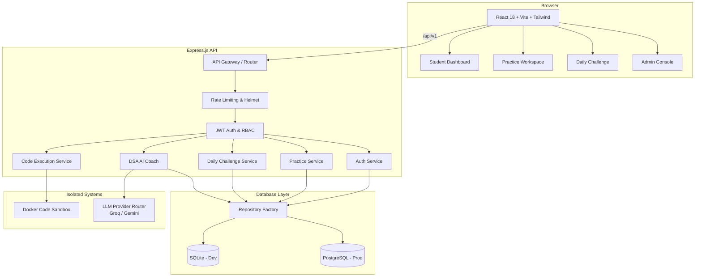

# Axly DSA Tracker — System Architecture

---

## High-Level Overview (Modular Monolith)

Axly DSA Tracker uses a **Modular Monolith** architecture. The React frontend and Express API are logically separated domains running independently, but the backend services (Auth, Practice, Submissions, Code Execution, AI) are deployed together within a single Express.js instance. 

There are no independent microservices, with the exception of the remote code execution runner which can optionally be deployed separately for isolated sandboxing.

---

## Repository Architecture (Dual-Driver)

The application uses a repository factory pattern that allows the same codebase to run on SQLite (development/testing) and PostgreSQL (production) without any service-level changes.

**Lazy initialization pattern:** All services call `getRepository()` at query time (not at module load). This prevents initialization race conditions during database setup and test isolation.

---

## DSA AI Engine — 4 Phases

### Phase 1: Deterministic Foundation (`dsaAiService.js`)
1. **Intent Classifier**: Parses user query keywords.
2. **Problem Matcher**: Matches current context to database problem IDs.
3. **Knowledge Graph Lookup**: Fetches hints, patterns, and complexities directly from the local DB.
*(0 LLM tokens used for known problems)*

### Phase 2: LLM Router (`llmRouter.js`)
The production fallback chain uses a 5-slot Groq/Gemini alternating strategy to ensure extremely high availability and prevent single-provider rate limiting.

### Phase 3: Coach Actions (`dsaAiCoachService.js`)
Assembles prompts from Phase 1 context, invokes Phase 2 LLM router, and self-corrects against the execution runner if code verification is required (max 2 attempts).

### Phase 4: Frontend Integration
Integrated via `DsaAiCoachPanel.jsx` and the global `App.jsx` sidebar. All requests are routed through `/api/v1/dsa-ai` to ensure API keys never reach the browser.

---

## Code Execution Sandbox (`executionService.js`)

Code execution is isolated. The `executionService.js` routes requests:
1. **External Runner (Production):** If `CODE_EXECUTION_SERVICE_URL` is configured, it forwards the payload to an isolated remote Docker sandbox.
2. **Local Sandbox (Development):** Spawns local child processes with strict timeouts (5,000ms), 64KB stdout caps, and guaranteed temporary directory cleanup.

Hidden test cases are never returned to the frontend, regardless of the execution outcome.

---

## Database Architecture

- **`users`**: Profiles, RBAC roles, leaderboard points, streaks.
- **`practice_problems` / `practice_progress`**: 80 curated problems and per-user state mapping (isolated from competitive scoring).
- **`daily_challenge_problems` / `daily_challenge_test_cases`**: Scheduled challenges determining the competitive leaderboard.
- **`submissions` / `code_submissions_log`**: Historical execution logs and code snapshot preservation.
- **`dsa_knowledge_graph`**: Verified hints and complexity answers for deterministic AI matching.

---

## Security Layers

1. **Edge/Transport:** Helmet (HTTP security headers), CORS whitelist (localhost, production domain).
2. **Rate Limiting:** Global `apiLimiter` (500 req/15min) + specific limiters (`authRateLimiter`, `executionRateLimiter`, `dsaAiLimiter`).
3. **Authentication:** Stateless JWT via HTTP Authorization Bearer headers.
4. **Authorization:** Explicit `requireRole('admin')` middleware for administrative endpoints.
5. **Data Validation:** Zod schema validation on all request bodies.
6. **Execution Isolation:** No network access from sandboxed code, strict memory/time bounds.
7. **Audit:** Immutable `audit_logs` table records all admin mutations (publishing, scheduling, user role changes).
